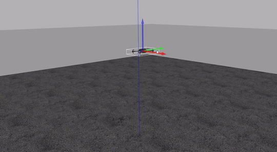

# mav_dob
[](https://github.com/Jaeyoung-Lim/mav_dob/actions/workflows/build_test.yml)

Disturbance Observer based trajectory tracking for MAVs



## Getting Started
### Install PX4 SITL(Only to Simulate)
Follow the instructions as shown in the [ROS with Gazebo Simulation PX4 Documentation](https://dev.px4.io/master/en/simulation/ros_interface.html)
To check if the necessary environment is setup correctly, you can run the gazebo SITL using the following command

```bash
cd <Firmware_directory>
DONT_RUN=1 make px4_sitl_default gazebo
```
To source the PX4 environment, run the following commands

```bash
cd <Firmware_directory>
source ~/catkin_ws/devel/setup.bash    # (optional)
source Tools/setup_gazebo.bash $(pwd) $(pwd)/build/px4_sitl_default
export ROS_PACKAGE_PATH=$ROS_PACKAGE_PATH:$(pwd)
export ROS_PACKAGE_PATH=$ROS_PACKAGE_PATH:$(pwd)/Tools/sitl_gazebo
```

You can run the rest of the roslaunch files in the same terminal

```bash
 roslaunch px4 posix_sitl.launch
```

You will need to source the PX4 environment in every new terminal you open to launch mav_dob. 

### Installing mav_dob

###### Create a catkin workspace:

This folder will probably be already created since the previous process would have created it. If it is not present, do:

```bash
mkdir -p ~/catkin_ws/src
```

###### Clone this repository

```bash
cd ~/catkin_ws/src
git clone https://github.com/Jaeyoung-Lim/mav_dob.git
```

Now continue either with wstool to automatically download dependencies or download them manually.

###### With wstool

wstool automates the installation of dependencies and updates all packages. If you have no problem updating the packages required by mav_dob and/or any other packages, follow this procedure. If not, follow the next 'Manually Download dependencies and build' section.

```bash
cd ~/catkin_ws
wstool merge -t src src/mavros_dob/dependencies.rosinstall
wstool update -t src -j4
rosdep install --from-paths src --ignore-src -y --rosdistro $ROS_DISTRO
catkin build
source ~/catkin_ws/devel/setup.bash
```

## Nodes
- dob_controller
- edob_controller (WIP)

## References
